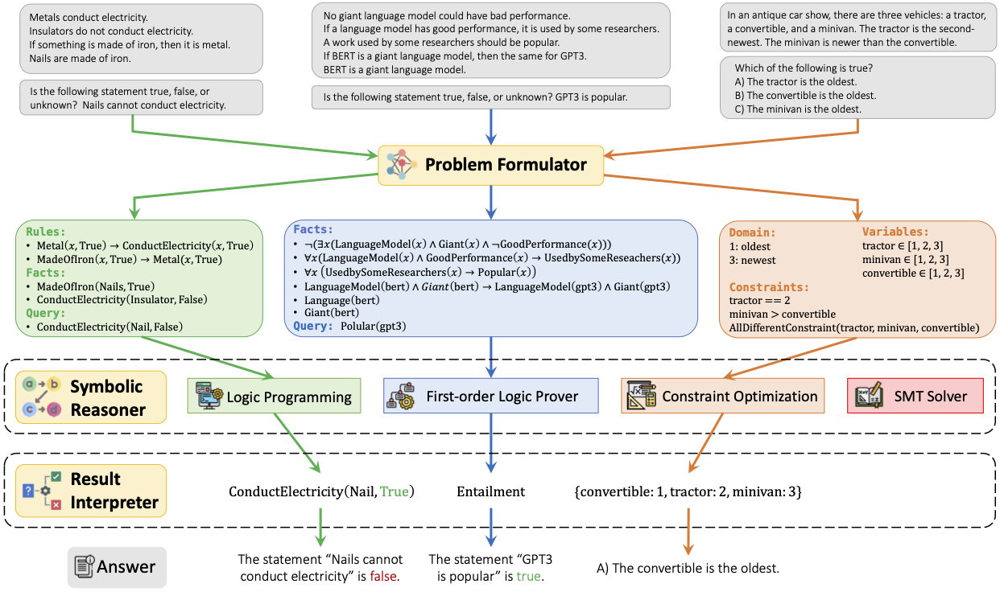

# Logic-LM
Data and Codes for ["LOGIC-LM: Empowering Large Language Models with Symbolic Solvers for Faithful Logical Reasoning"](https://arxiv.org/abs/2305.12295) (Findings of EMNLP 2023). 

Authors: **Liangming Pan, Alon Albalak, Xinyi Wang, William Yang Wang**. 

[NLP Group](http://nlp.cs.ucsb.edu/), University of California, Santa Barbara

## Introduction

Large Language Models (LLMs) have shown human-like reasoning abilities but still struggle with complex logical problems. This paper introduces a novel framework, **Logic-LM**, which integrates LLMs with symbolic solvers to improve logical problem-solving. Our method first utilizes LLMs to translate a natural language problem into a symbolic formulation. Afterward, a deterministic symbolic solver performs inference on the formulated problem. We also introduce a self-refinement module, which utilizes the symbolic solver's error messages to revise symbolic formalizations. We demonstrate Logic-LM's effectiveness on five logical reasoning datasets: ProofWriter, PrOntoQA, FOLIO, LogicalDeduction, and AR-LSAT. On average, Logic-LM achieves a significant performance boost of 39.2% over using LLM alone with standard prompting and 18.4% over LLM with chain-of-thought prompting. Our findings suggest that Logic-LM, by combining LLMs with symbolic logic, offers a promising avenue for faithful logical reasoning. 



First, install all the required packages:

```bash
pip install -r requirements.txt
```

## Datasets

The datasets we used are preprocessed and stored in the `./data` folder. We evaluate on the following datasets:

- [ProntoQA](https://github.com/asaparov/prontoqa): Deductive resoning dataset. We use the 5-hop subset of the *fictional characters* version, consisting of 500 testing examples. 
- [ProofWriter](https://allenai.org/data/proofwriter): Deductive resoning dataset. We use the depth-5 subset of the OWA version. To reduce overall experimentation costs, we randomly sample 600 examples in the test set and ensure a balanced label distribution.
- [FOLIO](https://github.com/Yale-LILY/FOLIO): First-Order Logic reasoning dataset. We use the entire FOLIO test set for evaluation, consisting of 204 examples.
- [LogicalDeduction](https://github.com/google/BIG-bench/tree/main/bigbench/benchmark_tasks/logical_deduction): Constraint Satisfaction Problems (CSPs). We use the full test set consisting of 300 examples.
- [AR-LSAT](https://github.com/zhongwanjun/AR-LSAT): Analytical Reasoning (AR) problems, containing all analytical logic reasoning questions from the Law School Admission Test from 1991 to 2016. We use the test set which has 230 multiple-choice questions. 

## Baselines

To replicate the **Standard-LM (Direct)** and the **Chain-of-Thought (CoT)** baselines, please run the following commands:

```bash
cd ./baselines
python gpt3_baseline.py \
    --api_key "Your OpenAI API Key" \
    --model_name "Model Name [text-davinci-003 | gpt-4]" \
    --dataset_name "Dataset Name [ProntoQA | ProofWriter | FOLIO | LogicalDeduction ｜ AR-LSAT]" \
    --split dev \
    --mode "Baseline [Direct | CoT]" \
    --max_new_tokens "16 for Direct; 1024 for CoT" \
```

The results will be saved in `./baselines/results`. To evaluate the results, please run the following commands:

```bash
python evaluate.py \
    --dataset_name "Dataset Name [ProntoQA | ProofWriter | FOLIO | LogicalDeduction ｜ AR-LSAT]" \
    --model_name "Model Name [text-davinci-003 | gpt-4]" \
    --split dev \
    --mode "Baseline [Direct | CoT]" \
```

## Logic Program Generation

To generate logic programs for logical reasoning problems in each dataset, at the root directory, run the following commands:

```bash
python models/logic_program.py \
    --api_key "Your OpenAI API Key" \
    --dataset_name "Dataset Name [ProntoQA | ProofWriter | FOLIO | LogicalDeduction ｜ AR-LSAT]" \
    --split dev \
    --model_name "Model Name [text-davinci-003 | gpt-4]" \
    --max_new_tokens 1024 \
```

The generated logic programs will be saved in `outputs/logic_programs`. You can also reuse the logic programs we generated in `./outputs/logic_programs`.

## Logic Inference with Symbolic Solver

After generating logic programs, we can perform inference with symbolic solvers. At the root directory, run the following commands:

```bash
DATASET="Dataset Name [ProntoQA | ProofWriter | FOLIO | LogicalDeduction ｜ AR-LSAT]"
SPLIT="Dataset Split [dev | test]"
MODEL="The logic programs are generated by which model? [text-davinci-003 | gpt-4]"
BACKUP="The random backup answer (random) or CoT-Logic collabration mode (LLM)"

python models/logic_inference.py \
    --model_name ${MODEL} \
    --dataset_name ${DATASET} \
    --split ${SPLIT} \
    --backup_strategy ${BACKUP} \
    --backup_LLM_result_path ./baselines/results/CoT_${DATASET}_${SPLIT}_${MODEL}.json
```

The logic reasoning results will be saved in `outputs/logic_inferences`. 

Backup Strategies:
- `random`: If the generated logic program cannot be executed by the symbolic solver, we will use random guess as the prediction.
- `LLM`: If the generated logic program cannot be executed by the symbolic solver, we will back up to using CoT to generate the prediction. To run this mode, you need to have the corresponding baseline LLM results stored in `./baselines/results`. To make the inference more efficient, the model will just load the baseline LLM results and use them as the prediction if the symbolic solver fails.

## Evaluation

To evaluate the logic reasoning results, please run the following commands:

```bash
python models/evaluation.py \
    --dataset_name "Dataset Name [ProntoQA | ProofWriter | FOLIO | LogicalDeduction]" \
    --model_name "The logic programs are generated by which model? [text-davinci-003 | gpt-4]" \
    --split dev \
    --backup "The basic mode (random) or CoT-Logic collabration mode (LLM)"
```

## Self-Refinement

After generating the logic programs without self-refinement, run the following commands for self-refinement:

```bash
DATASET="Dataset Name [ProntoQA | ProofWriter | FOLIO | LogicalDeduction ｜ AR-LSAT]"
SPLIT="Dataset Split [dev | test]"
MODEL="The logic programs are generated by which model? [text-davinci-003 | gpt-4]"
BACKUP="The random backup answer (random) or CoT-Logic collabration mode (LLM)"

python models/self_refinement.py \
    --model_name ${MODEL} \
    --dataset_name ${DATASET} \
    --split ${SPLIT} \
    --backup_strategy ${BACKUP} \
    --backup_LLM_result_path ./baselines/results/CoT_${DATASET}_${SPLIT}_${MODEL}.json
    --api_key "Your OpenAI API Key" \
    --maximum_rounds 3 \
```

The self-refinement results will be saved in `outputs/logic_inferences`. 

## Reference
Please cite the paper in the following format if you use this dataset during your research.

```
@inproceedings{PanLogicLM23,
  author       = {Liangming Pan and
                  Alon Albalak and
                  Xinyi Wang and
                  William Yang Wang},
  title        = {{Logic-LM:} Empowering Large Language Models with Symbolic Solvers for Faithful Logical Reasoning},
  booktitle    = {Findings of the 2023 Conference on Empirical Methods in Natural Language Processing (Findings of EMNLP)},
  address      = {Singapore},
  year         = {2023},
  month        = {Dec},
  url          = {https://arxiv.org/abs/2305.12295}
}
```

## Credit
The codes for the SMT solver are modified from [SatLM](https://github.com/xiye17/sat-lm). 

## Q&A
If you encounter any problem, please either directly contact the [Liangming Pan](liangmingpan@ucsb.edu) or leave an issue in the github repo.
